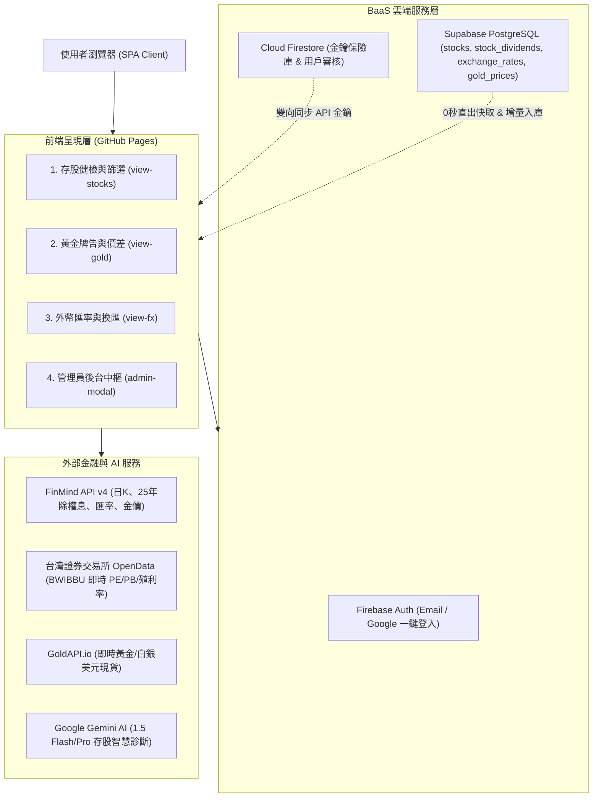
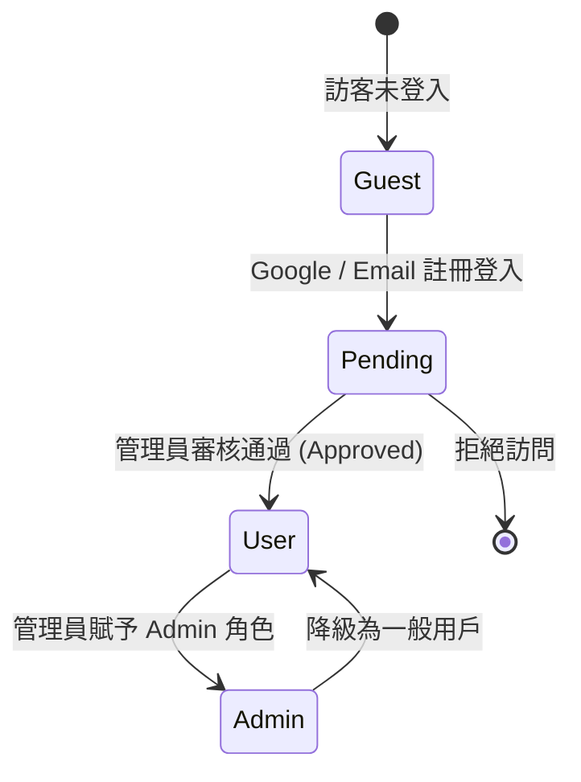

# 財務看看 (MaybeFinance) 系統架構與技術需求規格書

> [!IMPORTANT]
> 本文件為《財務看看 (MaybeFinance)》之完整系統規格書，詳細記錄專案定位、系統架構、外部 API 路由、資料庫結構 (DDL)、核心業務演算法、安全權限機制與部署規範。可作為跨對話接續開發、系統重構或架構審查之權威基準文檔。

---

## 1. 專案概述與定位 (Project Overview)

* **專案名稱**：財務看看 (MaybeFinance)
* **專案定位**：現代化無伺服器（Serverless SPA）個人化智能資產儀表板，整合台股 AI 存股健檢、實體黃金牌告與損益試算、以及全球外幣即時匯率換算。
* **部署目標**：GitHub Pages 靜態網站託管，全前端無須自建後端伺服器，透過 BaaS (Supabase + Firebase) 與外部金融 Open API 協同運作。
* **主要語言與技術棧**：
  * **前端核心**：Vanilla JavaScript (ES6+), HTML5, CSS3 (Glassmorphism 毛玻璃視覺與現代化卡片佈局)
  * **圖表視覺化**：Chart.js (折線走勢圖、歷史日 K 走勢圖、歷史匯率/金價走勢圖)
  * **圖標庫**：Font Awesome 6 (Free Solid / Brands)
  * **主資料庫 (快取與自選股)**：Supabase (PostgreSQL 15 + PostgREST + Row Level Security)
  * **身分驗證與金鑰保險庫**：Firebase Auth + Cloud Firestore + Google Identity Services (GIS)

---

## 2. 整體系統架構 (System Architecture)



---

## 3. 外部金融與 AI API 路由規範

| 服務提供商 | 用途 | 調用資料集 / 端點 | 鑑權與速率限制 |
| :--- | :--- | :--- | :--- |
| **FinMind API (v4)** | 台股清單、日 K 線、25 年配息、歷史匯率、歷史金價 | `TaiwanStockInfo`<br>`TaiwanStockPrice`<br>`TaiwanStockDividend`<br>`TaiwanExchangeRate`<br>`GoldPrice` | 支援無 Token 基礎額度；可填入專屬 `token` 享 **每小時 600 次** 獨立免限流通道。 |
| **台灣證券交易所 (TWSE)** | 每日盤後個股本益比、殖利率、股價淨值比 | `https://openapi.twse.com.tw/v1/exchangeReport/BWIBBU_ALL` | 免費公開 Open API，全市場每日盤後更新。 |
| **GoldAPI.io** | 國際黃金現貨即時美元報價 | `https://www.goldapi.io/api/XAU/USD` | 需於後台填入 `x-access-token`，每月提供免費 100 次即時請求。 |
| **Google Gemini API** | 自選股 8 大維度智能診斷與屬性推論 | `gemini-1.5-flash` / `gemini-1.5-pro` (REST API) | 需填入 Google AI Studio API Key，輸出嚴格 JSON 結構。 |

---

## 4. 資料庫實體結構與 DDL (Database Schema)

### 4.1. Supabase PostgreSQL 資料表

#### A. 自選股票清單 (`stocks`)
```sql
CREATE TABLE IF NOT EXISTS stocks (
    id TEXT PRIMARY KEY,
    stock_id TEXT NOT NULL UNIQUE,
    name TEXT NOT NULL,
    category TEXT DEFAULT '一般個股',
    price NUMERIC DEFAULT 0,
    change NUMERIC DEFAULT 0,
    change_percent NUMERIC DEFAULT 0,
    dividend_yield NUMERIC DEFAULT 0,
    pe NUMERIC DEFAULT 0,
    pb NUMERIC DEFAULT 0,
    market_cap NUMERIC DEFAULT 0,
    eps_5y NUMERIC DEFAULT 0,
    div_years INT DEFAULT 0,
    payout_ratio NUMERIC DEFAULT 0,
    beta NUMERIC DEFAULT 0.8,
    is_starred BOOLEAN DEFAULT FALSE,
    health_score INT DEFAULT 0,
    health_pass_count INT DEFAULT 0,
    ai_comment TEXT DEFAULT '',
    tags TEXT[] DEFAULT '{}',
    updated_at TIMESTAMPTZ DEFAULT NOW()
);
CREATE INDEX IF NOT EXISTS idx_stocks_stock_id ON stocks(stock_id);
ALTER TABLE stocks ENABLE ROW LEVEL SECURITY;
CREATE POLICY "Public access on stocks" ON stocks FOR ALL USING (true) WITH CHECK (true);
```

#### B. 25 年歷年與各季除權息全紀錄 (`stock_dividends`)
```sql
CREATE TABLE IF NOT EXISTS stock_dividends (
    id TEXT PRIMARY KEY,                       -- 唯一主鍵: {stock_id}_{announcement_date}_{year}_{ex_dividend_date}
    stock_id TEXT NOT NULL,                    -- 股票代碼 (如 006208)
    year TEXT NOT NULL,                        -- 期別標示 (如 2026Q3、2025H2、2024)
    cash_dividend NUMERIC NOT NULL DEFAULT 0,  -- 現金股利 (元)
    stock_dividend NUMERIC NOT NULL DEFAULT 0, -- 股票股利 (股)
    total_dividend NUMERIC NOT NULL DEFAULT 0, -- 合計股利 (元)
    ex_dividend_date TEXT DEFAULT '',          -- 除息交易日 (YYYY-MM-DD)
    payment_date TEXT DEFAULT '',              -- 現金發放日 (YYYY-MM-DD)
    announcement_date TEXT DEFAULT '',         -- 董事會決議公告日 (YYYY-MM-DD)
    created_at TIMESTAMPTZ DEFAULT NOW(),
    updated_at TIMESTAMPTZ DEFAULT NOW()
);
CREATE INDEX IF NOT EXISTS idx_stock_dividends_stock_id ON stock_dividends(stock_id);
ALTER TABLE stock_dividends ENABLE ROW LEVEL SECURITY;
CREATE POLICY "Public access on stock_dividends" ON stock_dividends FOR ALL USING (true) WITH CHECK (true);
```

#### C. 外幣歷史與即時匯率快取 (`exchange_rates`)
```sql
CREATE TABLE IF NOT EXISTS exchange_rates (
    id BIGSERIAL PRIMARY KEY,
    trade_date DATE NOT NULL,
    from_currency VARCHAR(10) NOT NULL,
    to_currency VARCHAR(10) NOT NULL,
    spot_sell NUMERIC NOT NULL,
    spot_buy NUMERIC NOT NULL,
    cash_sell NUMERIC,
    cash_buy NUMERIC,
    rate NUMERIC NOT NULL,
    created_at TIMESTAMPTZ DEFAULT NOW(),
    CONSTRAINT uq_trade_currency UNIQUE (trade_date, from_currency, to_currency)
);
ALTER TABLE exchange_rates ENABLE ROW LEVEL SECURITY;
CREATE POLICY "Public access on exchange_rates" ON exchange_rates FOR ALL USING (true) WITH CHECK (true);
```

#### D. 歷史金價快取 (`gold_prices`)
```sql
CREATE TABLE IF NOT EXISTS gold_prices (
    id BIGSERIAL PRIMARY KEY,
    trade_date DATE NOT NULL UNIQUE,
    usd_per_oz NUMERIC NOT NULL,
    twd_per_gram NUMERIC NOT NULL,
    created_at TIMESTAMPTZ DEFAULT NOW()
);
ALTER TABLE gold_prices ENABLE ROW LEVEL SECURITY;
CREATE POLICY "Public access on gold_prices" ON gold_prices FOR ALL USING (true) WITH CHECK (true);
```

### 4.2. Firebase Cloud Firestore 集合結構

1. **`system_config/vault` (系統金鑰保險庫)**：
   * `supabase_url`: Supabase 專案 URL
   * `supabase_anon_key`: Supabase 公開 Anon Key
   * `gemini_api_key`: Google Gemini API Key
   * `gold_api_key`: GoldAPI.io 存取金鑰
   * `finmind_token`: FinMind 專屬 API Token (每小時 600 次額度)
   * `updated_at`: 最後更新時間戳
2. **`app_users/{uid}` (用戶與授權管理)**：
   * `email`: 使用者電子郵件
   * `display_name`: 暱稱或名稱
   * `role`: 用戶角色 (`admin` \| `user` \| `pending`)
   * `status`: 帳號狀態 (`approved` \| `pending` \| `rejected`)
   * `created_at`: 註冊時間戳

---

## 5. 三大核心業務模組深度規格

### 5.1. 模組一：AI 存股健檢與篩選器 (`view-stocks`)

#### A. 存股 5 大維度核心清單與最多 8 項指標評分標準
依據經典存股書籍原則（大型不倒翁、穩定獲利、大方配息、低波抗跌、合理估價），系統建立最多 8 項評量準則。分母只計入有可靠來源且適用於該標的的指標；ETF 不以公司級 EPS 或盈餘分配率評分。

| 評估維度 | 指標項目 | 通過門檻 (Pass Criteria) | 權重 | 說明 |
| :--- | :--- | :--- | :--- | :--- |
| **1. 規模與護城河** | 股本規模 / 基金規模 | $\ge 300\text{ 億}$ | 1 項 | ETF 以證交所發行單位數乘最新價格估算基金規模；瀏覽器受 CORS 限制時使用最近的官方單位數快照。 |
| **2. 獲利體質** | 近 5 年平均 EPS | $\ge 1.0\text{ 元}$ | 個股 1 項 | ETF 顯示「不適用」，不以公司 EPS 評分。 |
| **3. 配息政策** | 連續配息年數 | 個股 $\ge 10\text{ 年}$；ETF $\ge 5\text{ 年}$ | 1 項 | 必須由 `stock_dividends` 的連續年度明細回算。 |
| **3. 配息政策** | 盈餘分配率 | $\ge 70\%$ | 個股 1 項 | ETF 配息來源不同，顯示「不適用」。 |
| **4. 安定與波動** | Beta 波動度 | $< 0.8$ | 1 項 | 以每日收盤報酬對 0050 重算，至少 20 個共同觀察值。 |
| **5. 估價與時機** | 現金殖利率 | $\ge 5.0\%$ | 1 項 | 依最新 12／4／2／1 期現金配息除以最新價格計算。 |
| **5. 估價與時機** | 股價淨值比 (PB) | $>0$ 且 $< 2.5$ | 有資料時 1 項 | ETF 僅使用可追溯的投資組合 P/B，否則不列入分母。 |
| **5. 估價與時機** | 本益比 (PE) | $> 0$ 且 $< 20.0$ | 有資料時 1 項 | ETF 僅使用可追溯的投資組合 P/E，否則不列入分母。 |

#### B. 3 大投資屬性分類推論
* 💰 **適合領高利息**：高股息策略且現金殖利率 $\ge 5\%$、配息流穩定（如 00878、00919、0056）。適合退休族或現金流需求者。
* 🛡️ **適合穩健存股**：大型產業龍頭、官股金控、連續 10 年以上配息、Beta $<0.8$、體質健全（如 2886 兆豐金、5880 合庫金、2002 中鋼）。適合長期資產增值。
* 📈 **適合波段賺價差**：產業具高度成長動能、波動度較大、PE 變動彈性高（如 2330 台積電、AI 伺服器代工廠）。適合追求資本利得之波段操作。
* 📊 **適合長期指數投資**：市值型 ETF（如 0050、006208）不標示為高股息，歸入穩健類並以專屬 ETF 診斷文字呈現。

#### C. 25 年配息歷史完整覆核引擎 (`loadStockDividends`)
```
[點開股票配息紀錄]
       │
       ▼
1. 查詢 Supabase stock_dividends ➔ 0 秒極速渲染現有資料
       │
       ▼
2. 向 FinMind 完整覆核 2000-01-01 至今的配息資料：
   ├─ [API 成功] ────────────► 以官方回傳資料取代過期快取，並清除 DB 多餘紀錄
   └─ [API 失敗或限流] ───────► 保留 Supabase 快取，避免畫面失去既有資料
       │
       ▼
3. 資料清洗與期別推論：
   ├─ 過濾無效 0 股利紀錄
   ├─ 除息日/公告日精準去重
   └─ 依年度配發次數自動標註期別 (月配 YYYY/MM、季配 YYYYQ1~Q4、半年配 YYYYH1~H2、年配 YYYY)
       │
       ▼
4. 欄位純淨化 (Sanitization) ➔ upsert 寫入 Supabase stock_dividends
       │
       ▼
5. 重新計算年化現金股利 ➔ 校正當前現金殖利率 ➔ 更新 UI
```

#### D. K 線與歷史走勢圖 (`renderStockChart`)
* 支援六種時間週期篩選：`1M`（1 個月）、`3M`（3 個月）、`6M`（半年）、`1Y`（1 年）、`3Y`（3 年）、`ALL`（全部歷史）。
* 採用 Supabase 快取與智慧增量補齊機制（僅在當日休市收盤後請求增量差額）。

---

### 5.2. 模組二：黃金牌告與價差試算 (`view-gold`)

* **即時牌告轉換**：
  * 從 GoldAPI / FinMind 取得國際金價（美元/金衡盎司 USD/oz）。
  * 換算台幣每錢（1 盎司 $= 8.2944$ 台錢）與每公克（1 盎司 $= 31.1035$ 公克）參考牌告。
  * 模擬銀樓買賣價差公式：
    $$\text{銀樓賣出價 (台幣/錢)} = \frac{\text{國際美元金價} \times \text{即時美元匯率}}{8.2944} \times 1.05$$
    $$\text{銀樓買進價 (台幣/錢)} = \frac{\text{國際美元金價} \times \text{即時美元匯率}}{8.2944} \times 0.95$$
* **實體黃金買賣損益試算機**：
  * 輸入：買入牌告價、賣出牌告價、重量單位（台錢 / 公克 / 金衡盎司）、扣重損耗率（預設 5%）、交易手續費。
  * 輸出：原始成本、折損後實收金額、淨損益總額、投資報酬率（ROI %）。
* **歷史金價走勢圖**：
  * 支援 30 天 / 90 天 / 1 年歷史折線走勢，自動與 Supabase `gold_prices` 同步。

---

### 5.3. 模組三：外幣匯率與換匯試算 (`view-fx`)

* **全球 30+ 國貨幣牌告**：
  * 支援 USD, JPY, EUR, GBP, AUD, CAD, SGD, CNY, HKD, KRW 等熱門幣別。
  * 即時顯示即期賣出價（換外幣）、即期買入價（換回台幣）、30 日平均價。
* **智慧換匯決策指標**：
  * 若 $\text{現價} < \text{30日均價}$ ➔ 標註 🟢「便宜！現在換外幣出國划算」。
  * 若 $\text{現價} > \text{30日均價}$ ➔ 標註 🟢「賺到！現在換回台幣划算」。
* **雙向即時試算機**：
  * 支援「台幣 $\to$ 外幣」與「外幣 $\to$ 台幣」雙向零延遲即時算力。
* **歷史匯率走勢圖**：
  * 支援動態區間查詢，自動偵測缺漏交易日並增量入庫 Supabase `exchange_rates`。

---

## 6. 安全、權限與管理員後台架構

### 6.1. 三級使用者權限控制 (Role-Based Access Control, RBAC)



1. **訪客模式 (Guest)**：可瀏覽公開行情與試算工具；自選股變更與高級 API 請求受限。
2. **待審核用戶 (Pending)**：登入後需等待管理員於後台啟用審核。
3. **正式用戶 (User)**：享有完整自選股同步、AI 存股健檢與個人化數據儲存。
4. **系統管理員 (Admin)**：
   * 享有「⚙️ 系統管理員後台中樞」完整權限。
   * 可在線上即時測試連線（Supabase, Firebase, Gemini AI, GoldAPI, FinMind）。
   * 可即時編輯與保存系統金鑰（自動加密存入 Firebase 保險庫）。
   * 可在線上對註冊用戶進行審核、授權與刪除。
   * 可一鍵複製資料庫建表 SQL 指令。

---

## 7. 內建三大資安審計與安全檢測技能庫 (Security Skills & Audit Framework)

專案已內建並整合 Trail of Bits 專業資安審計技能庫 (`.agents/skills/`)，可在後續維護、重構或新功能上線前隨時調用進行全自動化安全檢測：

| 資安技能名稱 (Skill Name) | 核心職責與檢測範圍 | 調用時機與目標產出 |
| :--- | :--- | :--- |
| **`security-audit`** | **全盤程式碼資安審計與漏洞獵捕**<br>針對 Web App 前端、API 路由、認證鑑權與資料儲存進行滲透測試與漏洞獵捕，專注於具實質破壞力之可利用性風險 (Exploitable Vulnerabilities)。 | 於版本發布或重大重構前執行，產出 `architecture.md`、`REPORT.md` 與結構化 `findings.json` 漏洞清單。 |
| **`audit-context-building`** | **審計前置架構與邊界上下文建模**<br>在漏洞獵捕前，逐一剖析所有關鍵函數的前提假設 (Assumptions)、保證條款 (Guarantees) 與外部依賴，精確繪製攻擊面邊界。 | 面對陌生模組或複雜業務邏輯時調用，產出 `audit-context/DOSSIER.md` 與未受保護假設 (Unchecked Assumptions) 報告。 |
| **`insecure-defaults`** | **不安全預設值與寬鬆存取策略稽核**<br>專門檢測不安全的預設配置、寬鬆的 Supabase RLS 策略、未經驗證的降級 Fallback、過度授權的 API Key 與明文憑證外洩風險。 | 於調整資料庫 Schema、RLS Policies 或第三方 API 串接時調用，杜絕後門與配置漂移。 |

### 7.1. 資安技能調用工作流 (Security Audit Workflow)
```
[發起資安審查]
       │
       ▼
1. audit-context-building ➔ 建立函數依賴與邊界假設矩陣 (DOSSIER.md)
       │
       ▼
2. insecure-defaults ➔ 掃描 Supabase RLS、Firebase 權限與 API 金鑰傳輸弱點
       │
       ▼
3. security-audit ➔ 發動多維度漏洞獵捕 (Phase 1~Phase 5)
       │
       ▼
4. 產出資安修復報告 (REPORT.md) 與自動修復建議
```

---

## 8. 專案檔案結構導覽 (Project File Tree)

```text
MaybeFinance/
├── .gitignore                      # Git 忽略清單 (嚴禁 commit 敏感金鑰)
├── GEMINI.md                       # AI Agent 操作行為準則與開發規範
├── README.md                       # 專案介紹與入口導引
├── index.html                      # 主畫面 SPA (含三大分頁、彈窗與管理員後台)
├── script.js                       # 應用程式核心業務邏輯 (狀態機、API 路由、增量引擎)
├── styles.css                      # 現代化毛玻璃 (Glassmorphism) 樣式表
├── icon/                           # 應用程式圖示 (PWA Favicon & Icons)
│   ├── stupid-32.png
│   ├── stupid-512.png
│   ├── stupid-black-32.png
│   └── stupid-black-512.png
├── docs/                           # 官方文檔與設定指南
│   ├── plans/
│   │   └── specs.md                # 【本文件】系統架構與技術需求規格書
│   ├── firebase_setup_guide.md     # Firebase 設定指引
│   ├── google_oauth_setup_guide.md # Google OAuth 登入設定指引
│   ├── github_pages_setup_guide.md # GitHub Pages 發布指南
│   ├── stock_selection_rules.md    # 存股 5 大維度經典理論指南
│   └── supabase_schema.sql         # Supabase PostgreSQL 初始化腳本
└── .agents/skills/                 # 內建資安審計技能庫
    ├── security-audit/             # 全盤資安審計技能
    ├── audit-context-building/     # 審計前置架構建模技能
    └── insecure-defaults/          # 不安全預設值檢測技能
```

---

## 9. 驗收標準與完成定義 (Definition of Done, DoD)

1. **功能完整性**：
   * 三大主分頁（存股健檢、黃金牌告、外幣匯率）切換流暢無卡頓。
   * 全台股標的點擊配息時，自動執行 25 年全歷史深度增量補齊與期別推論，並 100% 成功寫入 Supabase。
   * 管理員後台各項 API 連線測試均能返回真實狀態。
2. **代碼健康度**：
   * 無任何寫死之特定股票硬編碼常數（如 `FALLBACK_DIVIDEND_MAP` 已全數移除）。
   * 通過 `node --check script.js` 語法檢驗無報錯。
3. **安全規範**：
   * 無任何明文私鑰寫死於公開程式碼中；所有系統金鑰統一透過 Firebase 保險庫或管理員後台動態注入。
   * 具備完整資安技能支援，可隨時發動 `security-audit` 與 `insecure-defaults` 進行合規審查。
