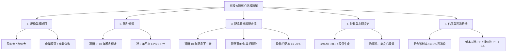

# 存股選股大師法則與核心指標大清單

本文件彙整 4 本經典存股書籍之選股策略，並將跨書重複與相近的觀念進行歸納整併，提煉為適合「財務白癡救星」系統化與量化的選股標準大清單。

---

## 第一部分：4 本經典著作選股原則

### 1. 《25歲存到100萬》（李勛）— 選股 5 大原則

* **原則 1：公司市值及股本都大**
  * 股本與市值夠大，籌碼不易被主力炒作，股價不易暴起暴跌，穩定度高。
* **原則 2：護城河多的公司**
  * 優先選擇產業龍頭股，具備穩定的市場地位與競爭優勢，不易被對手取代。
* **原則 3：獲利能力好的公司**
  * 尋找近 10 年來穩定獲利的公司，持續獲利是配發股利的基石。
* **原則 4：股利連續 10 年穩定發放**
  * 公司營運成熟，不需要過多增產投資，願意將利潤持續回饋股東。
* **原則 5：計算本益比 (PE)**
  * 公式：`本益比 = 現價 ÷ 預估(或去年) EPS`。
  * 本益比越低代表買價越便宜、回本年限越短。

---

### 2. 《存股輕鬆學》（孫悟天）— 5 大選股法則

* **法則 ①：選擇體質健全的公司**
  * 近 5 年平均 EPS > 1 元，且持續成長或維持持平，避開逐年衰退或暴起暴跌者。
  * 偏好每月公布盈餘（如金融股、電信股）之標的，資訊透明度高。
* **法則 ②：選擇股價穩定度高的公司**
  * 股本 > 300 億元（亦可視情況放寬至 100~200 億）。
  * 股價波動度 $\beta$ (Beta) 值 < 0.8（作者更偏好 $\beta < 0.6$ 的官股/大型牛皮股）。
* **法則 ③：每年配發股利股息**
  * 近 5 年每年現金股利 > 0.5 元，或近 5 年每年股票股利 > 0.5 元，藉由配息降低持股成本。
* **法則 ④：股價不能離淨值太遠**
  * 股價淨值比 (PB) < 2.5（公式：`股價 ÷ 每股淨值`），避免買在過度炒作的昂貴價。
* **法則 ⑤：股性相合**
  * 挑選適合自己投資性格的股票，能安心睡覺、不隨市場起伏焦慮。

---

### 3. 《我用1檔ETF存自己的18%》（陳重銘）— 不敗選股 4 原則

* **原則 1：穩定獲利的績優龍頭股**
  * 選擇老牌且長期獲利穩健的龍頭企業，重「本益比」而非「本夢比」。
* **原則 2：產業分散**
  * 將資產分散在民生必需、金融、電信、電子及指數型 ETF，避免單一產業風險。
* **原則 3：低本益比**
  * 好公司更要買在好價位，利用本益比評估物美價廉的進場點。
* **原則 4：股利多且穩定的高殖利率股**
  * 殖利率長期穩定維持高檔，避開配息忽高忽低的景氣循環股。

---

### 4. 《給存股新手的財富翻滾筆記》（小車）— 核心持股 5 大條件

* **條件 ①：穩定配息超過 10 年以上**
  * 歷經景氣多空考驗，代表獲利能力與股利政策高度成熟。
* **條件 ②：每年配息落差不要太大**
  * 避開景氣循環股，維持穩定且可預測的退休生活費現金流。
* **條件 ③：股價波動小，可以安心持有**
  * 偏好價格牛皮的官股金控，不易因漲跌引發心理焦慮而追高殺低。
* **條件 ④：公司大方，盈餘分配率 70% 以上**
  * 公司賺 100 元願意拿出 70 元以上發放給股東（如官股金控常達 80% 以上）。
* **條件 ⑤：股息殖利率 5% 以上（買進門檻）**
  * 設定進場安全邊際：殖利率 $\ge 5\%$ 才買進；若因股價上漲導致殖利率低於 5%，則暫停買進改買其他標的。

---

## 第二部分：跨書觀念匯總 — 存股核心 5 大維度大清單

將上述 4 本書的概念去蕪存菁，整併為 5 大核心面向與 10 條量化/質化標準：

> **ETF 適用範圍**：書摘中的 EPS、公司股本及盈餘分配率原本是公司級指標，不能直接套用 ETF。系統對 ETF 改用基金規模、配息年資、近期待遇殖利率與 Beta；只有具有可追溯官方投資組合資料時才評估 ETF 的 P/E、P/B。市值型 ETF 與高股息 ETF 必須分開分類。

### 維度一：公司規模與護城河（安全性與抗操縱）
1. **股本與市值大**：
   * 建議標準：**股本 > 300 億元**（中小型股可放寬至 100~200 億元）。
   * 核心目的：發行量大、流動性佳，主力難以人為炒作操控。
2. **產業龍頭與護城河**：
   * 優先選擇產業前幾大龍頭或具有官股背景之公司。
3. **產業多元分散**：
   * 投資組合涵蓋金融、電信、民生必需、電子龍頭及指數型 ETF，避免單一產業系統性風險。

---

### 維度二：獲利能力與體質（持續賺錢的能力）
4. **獲利長期穩健**：
   * 建議標準：**連續 5 ~ 10 年穩定獲利**，無大幅虧損。
   * **近 5 年平均 EPS > 1 元**，且趨勢平穩或持續成長，避開逐年遞減者。
5. **資訊透明度**：
   * 優先選擇每月公布自結盈餘（EPS）之標的（如金融股、電信股），能提早掌握營運狀況。

---

### 維度三：配息政策與現金流（被動收入的來源）
6. **長期穩定配息**：
   * 建議標準：**連續配發股利 10 年以上**不中斷。
   * **近 5 年平均現金或股票股利 > 0.5 元**。
7. **配息平穩性（避開景氣循環）**：
   * 每年配息金額落差小，避免「今年發 5 元、明年發 1 元」的景氣循環股。
8. **公司大方分享利潤**：
   * 建議標準：**盈餘分配率 $\ge 70\%$**（賺 100 元至少發 70 元給股東）。

---

### 維度四：股性與波動度（抱得住的安定感）
9. **低波動與防禦性**：
   * 建議標準：**$\beta$ (Beta) 值 < 0.8**（更嚴格可抓 $\beta < 0.6$）。
   * 股價牛皮、不易隨大盤暴起暴跌，降低心理焦慮。
10. **股性相合**：
    * 適合自己的風險耐受度，能安心長抱、不需頻繁盯盤。

---

### 維度五：估價指標與進場時機（便宜好買點）
11. **現金殖利率安全邊際**：
    * **進場標準：現金殖利率 $\ge 5\%$**。
    * 若股價漲高導致殖利率 < 5%，停止買進並轉向其他符合條件之標的。
12. **合理估價不買貴**：
    * **股價淨值比 (PB) < 2.5**（確保股價未過度偏離資產價值）。
    * **低本益比 (PE)**（以合理或偏低價格買進績優股）。

---

## 第三部分：經典常勝標的名冊（書中實例彙整）

| 類別 | 代表標的 | 符合特色 |
| :--- | :--- | :--- |
| **官股金控** | 兆豐金 (2886)、第一金 (2892)、合庫金 (5880)、華南金 (2880) | 股本超大、Beta < 0.6、配息穩定、政府大股東不倒閉、盈餘分配率高達 80% |
| **民營金控** | 玉山金 (2884)、中信金 (2891)、富邦金 (2881)、國泰金 (2882)、元大金 (2885) | 獲利動能佳、配息大方、資訊每月公布 |
| **民生 / 電信** | 中華電 (2412) | 護城河極強、Beta 極低（約 0.2）、民生剛性需求、每年穩定高配息 |
| **老牌傳產** | 中鋼 (2002)、南亞 (1303)、正新 (2105) | 老牌龍頭、股本龐大（需注意景氣循環週期與配息落差） |
| **電子龍頭** | 廣達 (2382)、仁寶 (2324)、英業達 (2356) | 股本大、配息大方、長期獲利穩定 |
